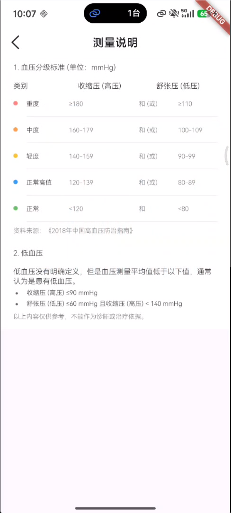
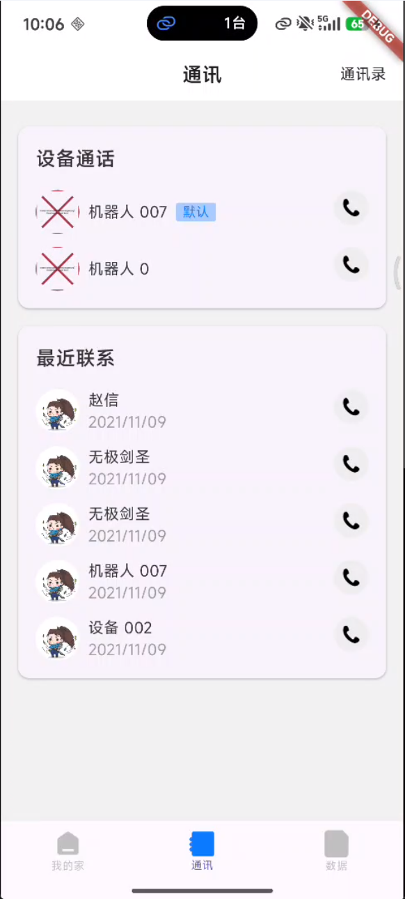
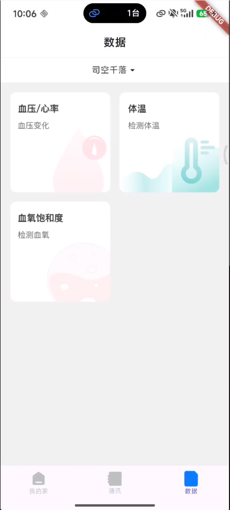
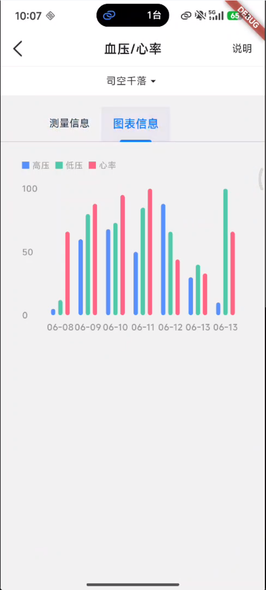
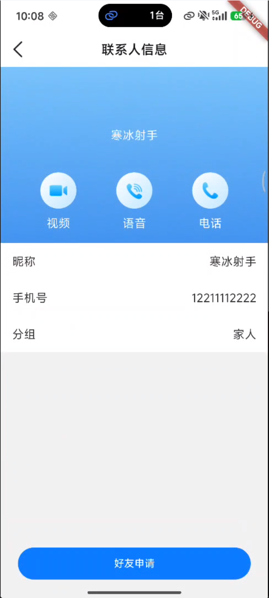
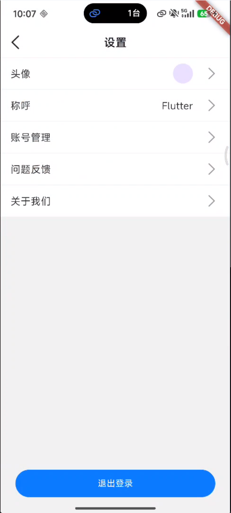
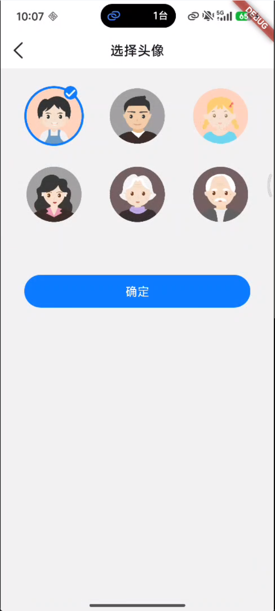

# Hello Flutter

Flutter 学习项目，一个功能丰富的跨平台应用示例。

## 项目简介

这是一个基于 Flutter 开发的综合性学习项目，涵盖了常见的移动端开发场景，包括用户认证、数据展示、联系人管理等功能模块。项目采用 GetX 状态管理，支持 Android、Web、Windows 等多平台运行。

## 功能特性

### 用户模块
- 登录/注册/找回密码
- 完善个人信息
- 修改密码
- 账号管理

### 首页功能
- 数据概览展示
- 图表统计
- 扫码功能
- 测量提醒

### 联系人管理
- 联系人列表
- 联系人详情
- 通话记录
- 新增联系人

### 数据管理
- 数据详情查看
- 数据图表展示
- 家庭列表管理

### 设置功能
- 应用设置
- 意见反馈
- 关于页面
- 退出登录

### 其他功能
- 图片浏览
- WebView 页面
- 照片查看器

## 技术栈

### 核心框架
- **Flutter**: 3.38.3
- **Dart**: 3.10.1
- **GetX**: 状态管理、路由管理、依赖注入

### 网络与数据
- **Dio**: HTTP 网络请求
- **json_serializable**: JSON 序列化
- **sp_util**: 本地存储

### UI 组件
- **flutter_smart_dialog**: 弹窗组件
- **oktoast**: Toast 提示
- **flutter_slidable**: 侧滑删除
- **sticky_headers**: 悬浮头部
- **azlistview**: 字母索引列表
- **fl_chart**: 图表组件
- **photo_view**: 图片浏览
- **webview_flutter**: WebView

### 工具与功能
- **image_picker**: 图片选择
- **url_launcher**: URL 启动
- **device_info_plus**: 设备信息
- **mobile_scanner**: 扫码功能
- **cached_network_image**: 图片缓存
- **lottie**: 动画效果
- **intl**: 国际化

### 平台支持
- **Android**: 完整支持
- **iOS**: 完整支持
- **Web**: 支持（已升级新版加载方式）
- **Windows**: 支持桌面端

## 快速开始

### 环境要求
- Flutter SDK: >=3.0.0 <4.0.0
- Dart SDK: >=3.0.0
- Android Studio / VS Code
- Android SDK (Android 平台)

### 安装依赖

```bash
flutter pub get
```

### 运行项目

```bash
# 运行到 Android
flutter run

# 运行到 Web
flutter run -d chrome

# 运行到 Windows
flutter run -d windows

# 构建发布版本
flutter build apk          # Android
flutter build web          # Web
flutter build windows      # Windows
```

## 平台配置

### Web 平台
已升级至 Flutter 3.16+ 推荐的新版加载方式：
- 使用 `flutter_bootstrap.js` 替代旧版 Service Worker 手动注册
- 添加 viewport meta 标签优化移动端显示
- 精简代码，提升加载性能

### Windows 平台
- CMake 版本: 3.15+
- Visual Studio 2022+
- Windows SDK 10.0.26100.0

## 截图展示

<div align="center">
  
  
  
  
  
  
  
</div>

## 开发规范

- 使用 GetX 进行状态管理
- 页面与控制器分离
- 遵循 MVC 架构模式
- 统一使用 `sp_util` 进行本地存储
- 网络请求统一封装在 `net` 目录

## 许可证

本项目仅供学习参考使用。